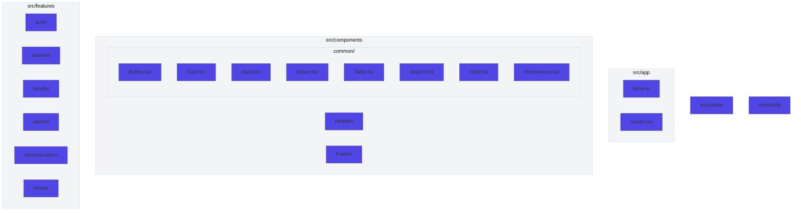
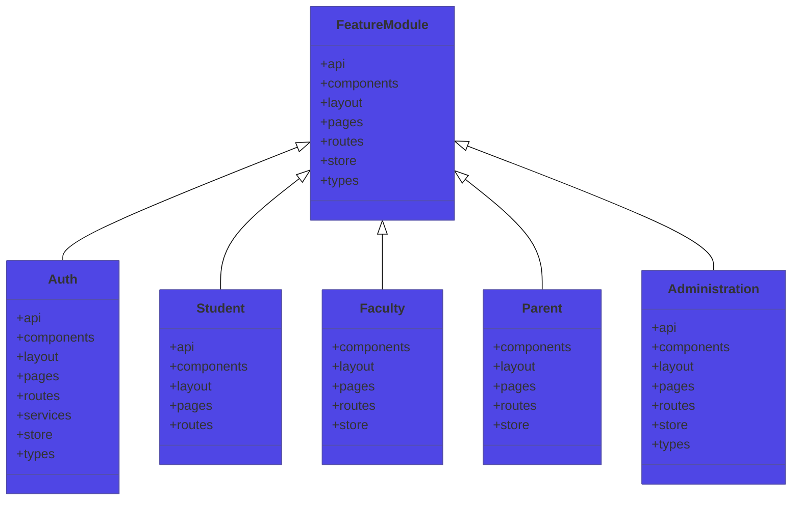
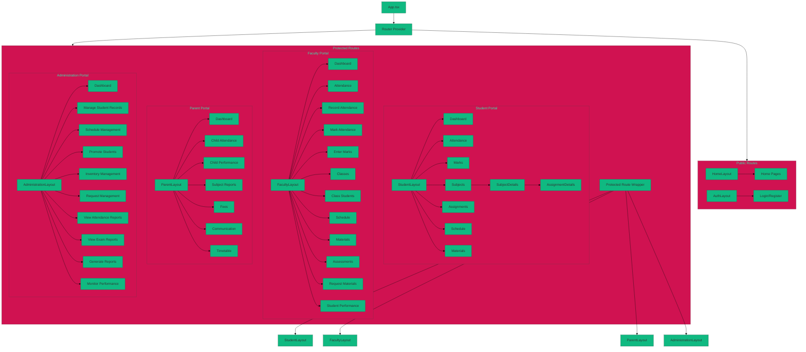
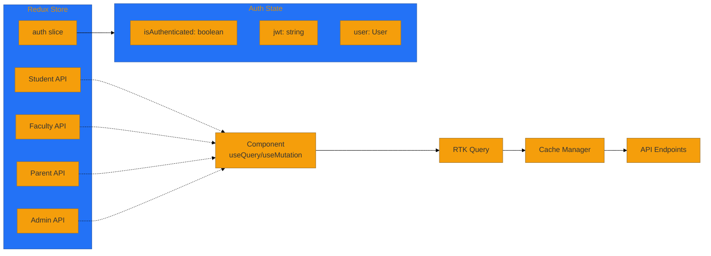
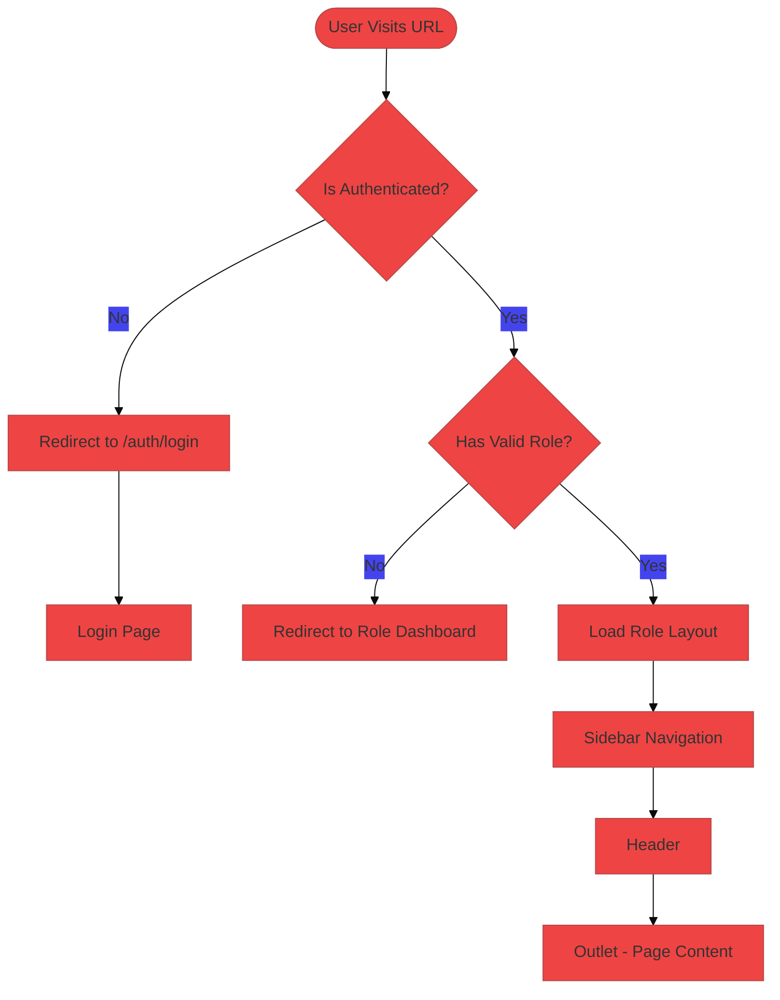
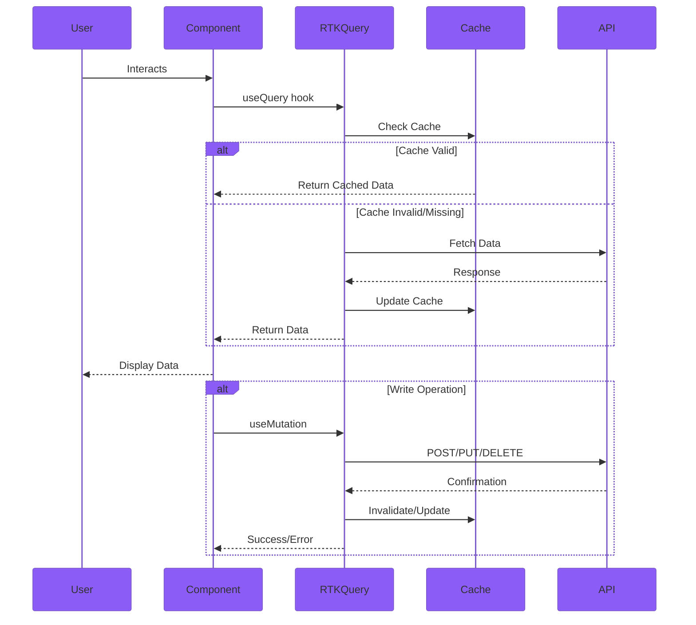
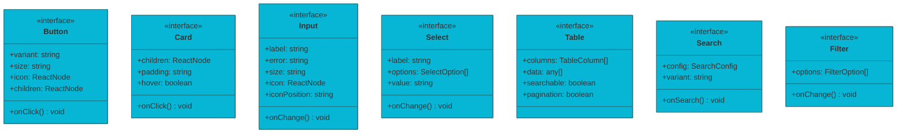
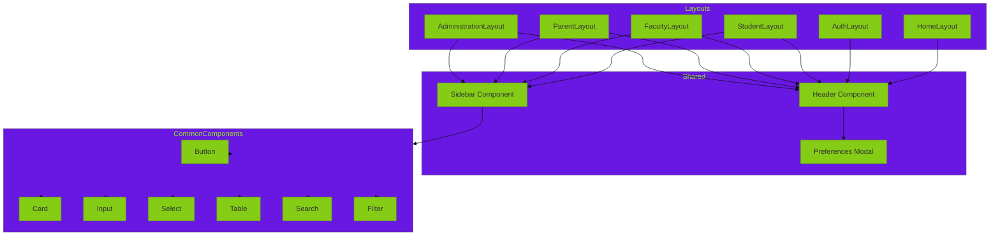
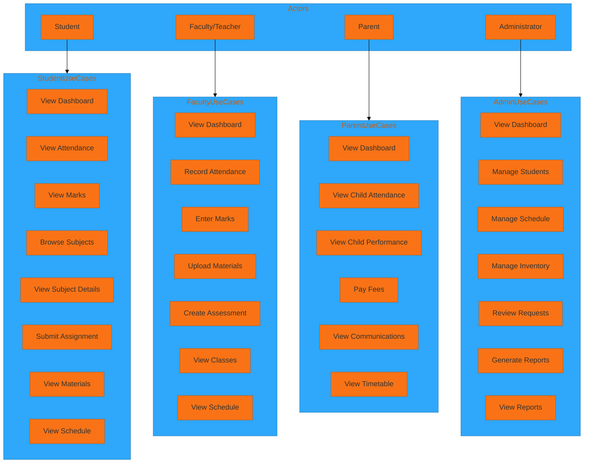
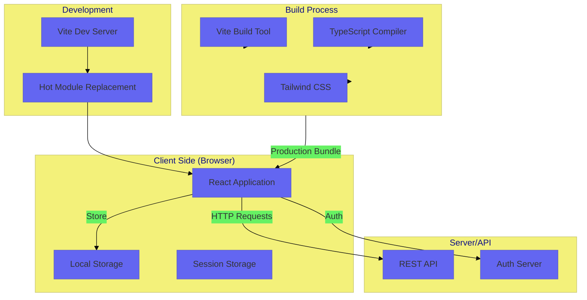

# Frontend Architecture Diagram (Mermaid.js)

This document contains UML 2.0 compliant diagrams generated using Mermaid.js syntax.

## 1. Package Diagram - High-Level Structure



---

## 2. Component Diagram - Feature Module Structure



---

## 3. Component Hierarchy Diagram



---

## 4. State Management Diagram



---

## 5. Route Protection Flow Diagram



---

## 6. Data Flow Diagram



---

## 7. Common Components Class Diagram



---

## 8. Student Subject Flow Activity Diagram

```mermaid
%%{init: {'theme': 'base', 'themeVariables': { 'primaryColor': '#EC4899'}}}%%
flowchart TD
    Start([Student Clicks Subjects]) --> Navigate1[/student/subjects]
    Navigate1 --> SubjectList[Display Subject Cards]
    
    SubjectList --> ClickSubject{Click Subject}
    ClickSubject --> Navigate2[/student/subjects/:name]
    Navigate2 --> SubjectDetails[Subject Details Page]
    
    SubjectDetails --> Tab1{Chapters Tab}
    Tab1 --> ShowChapters[Show Chapters with Weekly Topics]
    ShowChapters --> SelectChapter[Click to Expand]
    SelectChapter --> WeeklyBreakdown[Show Weekly Breakdown]
    
    SubjectDetails --> Tab2{Materials Tab}
    Tab2 --> ShowMaterials[Show Materials Grouped by Week]
    ShowMaterials --> Download[Download Material]
    
    SubjectDetails --> Tab3{Assignments Tab}
    Tab3 --> ShowAssignments[Show Assignment List]
    ShowAssignments --> ClickAssign[Click Assignment]
    ClickAssign --> Navigate3[/student/assignments/:id]
    Navigate3 --> Questions[Display Questions]
    
    Questions --> FillMCQ[Fill MCQ]
    Questions --> FillObjective[Fill Objective]
    Questions --> FillSubjective[Fill Subjective]
    
    FillMCQ --> Submit1[Submit Assignment]
    FillObjective --> Submit1
    FillSubjective --> Submit1
    
    Submit1 --> Success[Show Success Message]
```

---

## 9. Component Composition Diagram



---

## 10. Use Case Diagram



---

## 11. Deployment Diagram



---

## View Diagrams

To view these diagrams, you can use:
1. **Mermaid Live Editor**: https://mermaid.live/
2. **VS Code**: Install "Mermaid Preview" or "Mermaid Markdown Preview" extension
3. **Notion/Obsidian**: Native Mermaid support
4. **GitHub**: Rendered automatically in markdown files

Example rendering in markdown:
```markdown
```mermaid
// diagram code here
```
```
